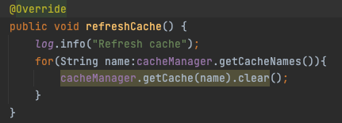
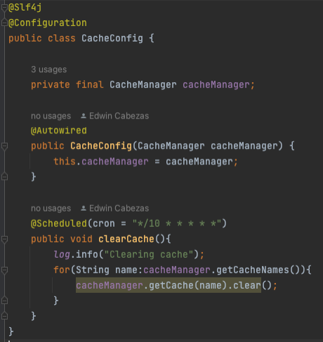

# **Implementación de Spring Boot Cache**
This project is an example of how to implement cache in a Spring Boot application using the @Cacheable annotation.

## **Requirements**

To run this project you need to have installed:

* Java 8 or higher
* Gradle 4.10.2 or higher

## **Run the application**

**Clone this repository:** 
git clone https://github.com/edcab/spring-cache-demo.git

**Go to the root folder:** cd demo
**Run the following command to build and run the application:** mvn spring-boot:run
**For testing purpose please: ** http://localhost:8080/catalog/country

## **How it works**
The cache implementation in this application has been done using the **@Cacheable annotation of Spring Boot**. This annotation is used to indicate that the method that contains it must be cached. In this example, the demo method of the **CountryServiceImpl** class is the one that is being cached.

To use this annotation, we must first add a cache implementation to our application. In this case, the Spring Boot cache implementation has been used, which uses a memory cache.

To add the cache implementation to our application, we must add the following dependency to the **build.gradle** file:
`implementation group: 'org.springframework.boot', name: 'spring-boot-starter-cache', version: '3.0.5'`

After adding the dependency, we must indicate to Spring Boot that we want to use the cache implementation. To do this, we must add the following annotation to the **DemoApplication** class:
`@EnableCaching`

After adding the annotation, we must indicate to Spring Boot that we want to cache the results of a certain method. To do this, we simply add the **@Cacheable** annotation to the method. In this case, the cache has been named _"countries"_, optionally we could add a method parameter to be used as a cache key, and configure a cache expiration time of 60 seconds, example:
`@Cacheable(cacheNames = "countries", key = "#param", ttl = 60)` for the example we are going to refresh the cache by means of an HTTP method and a cron expression

If the result of the method is found in the cache, the value of the cache will be returned directly, without executing the method. If the result is not found in the cache, the method will be executed and the result will be stored in the cache for future calls.

## Clear cache
To clear the cache, a method has been created in the **CountryController** class that is executed when a GET request is made to the URL http://localhost:8080/catalog/country/clear. This method calls the clearCache method of the **CountryServiceImpl** class, which is in charge of clearing the cache.

## Cron expression

To REfresh the cache every ten seconds, a cron expression has been added to the `@Scheduled annotation`, which is executed every ten seconds.
This cron expression is in charge of calling the clearCache method of the **CountryServiceImpl** class, 
which is in charge of clearing the cache.

